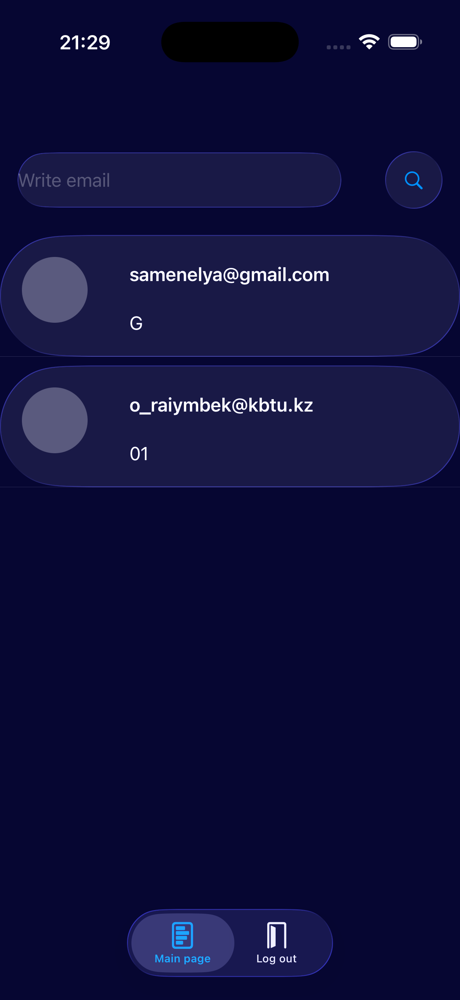
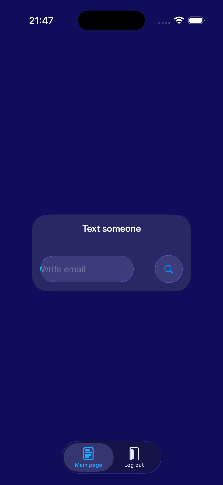
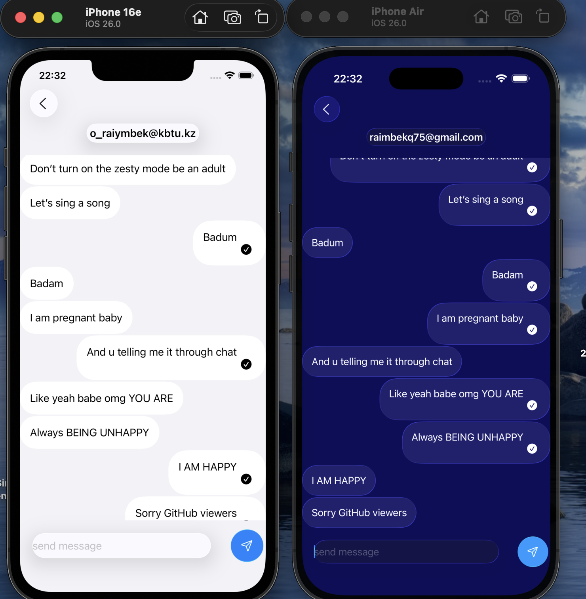

# Telegram Killer

Chat iOS client using SwiftUI + UIKit . Allows sending plain text  messages and marking  as read in real-time, saving chats locally.

MADE FOR PEOPLE BY PEOPLE

##  Screenshots

  
  

  

## Tech Stack:

Swift Foundation

SwiftData

Modern Concurrency

UIKit navigation + SwiftUI MVVM

Tokens Cycle

Liquid Glass

## Prerequisites :

iOS 26+

Xcode 26

## Usage :

 Clone this repository

 git clone https://github.com/Raimbek-pro/telegram-killer.iOSclient.git
 cd telegram-killer.iOSclient
 open telegram killer.xcodeproj  

## follow instructions from Telegram-killer.API  :

https://github.com/blendereru/telegram-killer.API

